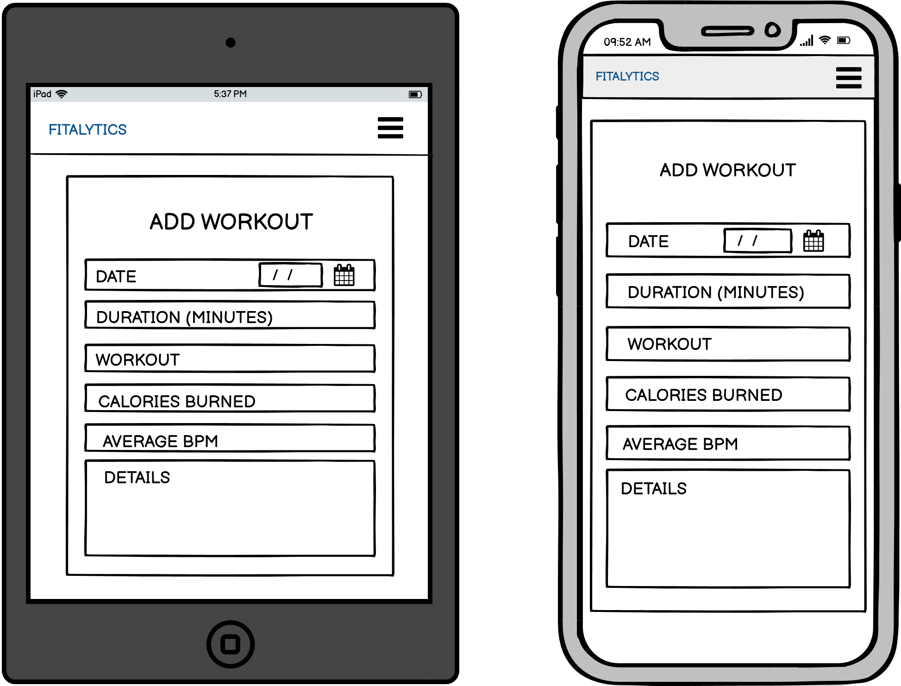
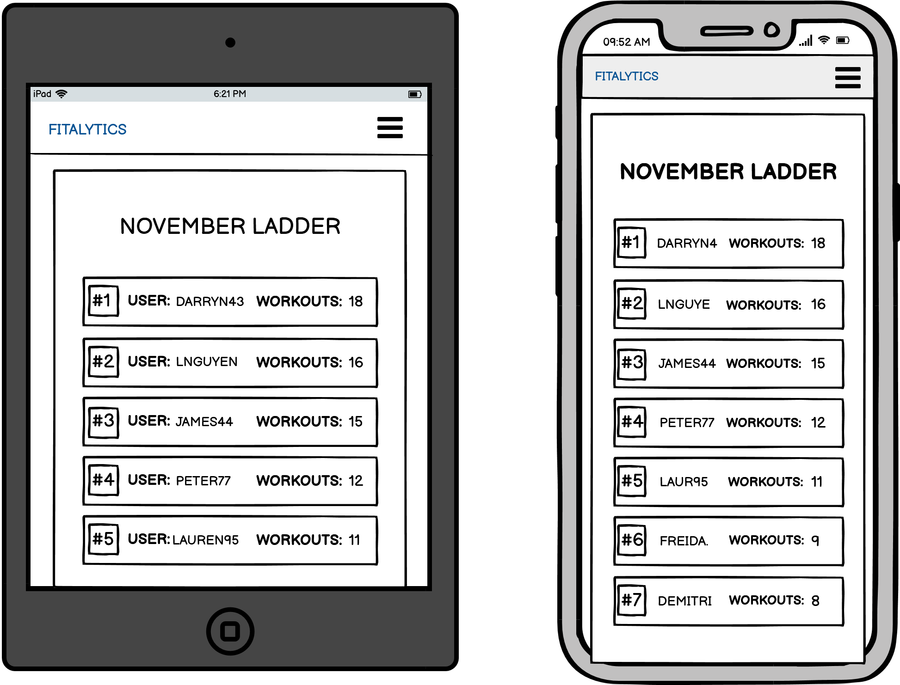

# **Fitalytics**

# Links
### [Deployed Application](https://fitalytics.netlify.app/)
### [Rails API Github Repo](https://github.com/Steve-Drewery/fitalytics-api)
### [React Frontend Github Repo](https://github.com/connorca22/fitalytics)

# Instructions for running locally
### 1) Clone the react front end directory 
### 2) Open directory and install dependencies
`npm install` 
### 3) In `config>api.js` change the axios baseURL to http://localhost:3000
### 4) Start the development server (localhost:3001 by default)
`npm start` 

### 5) Clone the rails back end directory 
### 6) Open directory and install gems
`bundle install` 
### 7) Create the postgresql database, migrate it, and seed it (depending on your OS you may need to populate credential and setting fields in database.yml to do this)
`rails db:create && rails db:migrate && rails db:seed`

### 9) Update the `cors.rb` file to accept calls from http://localhost:3001 

### 10) Boot the rails server (defaults to localhost:3000) 

### 11) Done! Now the react and rails applications will be able to communicate. 

# Description

## Purpose
The application is designed to help users keep a record of their workouts, as well as achieve their fitness goals. It does this by allowing users to create records with details of each workout they undertake, view the details of historical workout records, set and meet weekly goals, and compete to climb the overall user ladders (based on number of workouts completed). 

## FEATURES/FUNCTIONALITY
- User Management
    > The ability to create a user account, as well as sign in, and sign out will be implemented by updating/reading our User model and generating JSON Web Tokens using the JWT gem. 
- Authorisation 
    > JWT also allows us to implement authorisation in the application, by only allowing those users that have been authenticated with JWT to access protected routes (protected routes set up with react router)
- Workouts
    >Add workout records to your account (including type, duration, distance, date, etc)

    >View a history of your previous workout records 
- Weekly goals
    >Add a weekly workout goal (i.e 4 workouts per week)

    >Your total number of weekly workouts will be displayed in your user portal (i.e "2/4 workouts completed this week")  
- Ladder
    >View a table ordered by how many workouts app users have completed. 

    Your position on this ladder will be displayed in your user portal (i.e You are 23/100 in the user ladder!) 

## Target Audience
At a high level, this application is for users who want to leverage digital tools to achieve their fitness goals. This could apply to: 
- Active individuals undertaking physical programs who would like to use an app to track their progress 
- People who struggle to work out consistently and want to leverage tracking and goal setting to help them maintain a regular routine. 
- People with health conditions that require they be mindful of their physical activity, and monitor their level of physical fitness. 
- Competitive People who would like to compete with others for higher workout activity (via their position in the ladder system) 

## Tech Stack

**Version control** 
- Git & Github

| Front End                 |                  | 
| :------------------------:|:-----------------:
| Programming Language      | Javascript 
| Front End Framework       | React      
| Deployment                | Netlify   
| Styling                   | Styled-components 
| Testing                   | Jest     
| HTTP Requests             | Axios   

| Back End                  |                  | 
| :------------------------:|:-----------------:
| Programming Language      | Ruby 2.7.5 
| Server Side Framework     | Rails 6.1.6   
| Testing                   | Rspec
| Gems                      | JWT
| DBMS                      | Postgresql   
| Deployment                | Heroku 

# Dataflow Diagram

# Application Architecture Diagram

# User Stories
- As a casual runner, I would like to be able to keep track of my previous run times so I can try to beat my time on my next run.
    > Revised outlook: As a casual runner, I would also like to save the distance I ran so I can track my progress accurately.
- As a competitive person, I would like to be able to share my workout with friends so we can compete against each other.
    > Revised outlook: As a competitive person I would also like to be able to send my friends messages so I can invite them to workout with me.
- As a gym junkie, I would like to be able to log complete workouts with reps/sets so I can improve next session.
    > Revised outlook: As a gym junkie, I would also like to have reminders showing what I logged last year/month so I can be motivated with my progress.
- As a bodybuilder, I would like to be able to post photos to a live feed so I can promote my physique.
    > Revised outlook: As a body builder, I would also like to be able to post videos so I can share my posing.
- As a world class athlete, I would like to be able to compete against people around the world from my hometown so I can show everyone I am the best.
    > Revised outlook: As a world class athlete I would also like to be informed on any other world class athletes that are in my area so I can train with them.
- As a local runner, I would like to be able to track my location so I can keep track of how far I have run.
    > Revised outlook: As a local runner I would also like to be able to track my steps so I can inform my coach.
- As someone who struggles with motivation, I would like to have a reward system for reaching  my goals so I can motivate myself through positive reinforcement.

- As a busy business man, I would like a reminder or notification system to show when my friends workout and when my previous workout was so I can keep in touch with friends and keep track of my fitness.

- As a dietitian, I would like to be able to keep track of how many calories I am burning throughout a workout so I can program my diet more efficiently.
    > Revised outlook: As a dietitian I would also like to be able to see other peoples workouts such as clients and friends so I can help them reach their goals.
- As someone with a health condition that is exacerbated by poor physical fitness, I would like to be able to track my physical activity to ensure I am maintaining a baseline level of fitness.
    > Revised outlook: As someone with a health condition that is exacerbated by poor physical fitness I would also like to be able to log my pedometer to track my step count accurately.

# Wireframes
### Home Desktop

### Home Tablet/Phone

### Sign in Desktop

### Sign in Tablet/Phone

### Sing up Desktop

### Sign up Tablet/Phone

### Home portal Desktop

### Home portal Tablet/Phone

### Add workout Desktop

### Add workout Tablet/Phone

### Ladder Desktop

### Ladder Tablet/Phone

### Goals Desktop

### Goals Tablet/Phone

# User Testing
Once the major functionality had been implemented towards the end of the build, each team member presented the application to several peers for user testing. We categoriesed the different actions they should take (e.g create an account, log in, create a workout, set your weekly goal, etc), and recorded the results of these actions. The user testing revealed an unforseen display issue with the weekly goal widget on the dashboard, which was repaired shortly afterwards. A full breakdown of user testing results [can be found here](https://docs.google.com/spreadsheets/d/1tw-eoWQ5Yg2aMXyanKJRsfu4cTnMj7bmjz--hMtk_1E/edit?usp=sharing).

# Planning vs Final Implementation  
There are several discrepancies between our original blueprint and the final submission.
### Goals
We deemed giving "Goals" it's own page unnecessary, and instead displayed the weekly goal on the dashboard next to a button linking to the Update Goal page.
### Types Of Exercises
Due to time constraints we only implemented 4 major types of available exercises for fitness tracking (HIIT, Run, Swim, Weights). Many others, and the ability to create your own category will be implemented in a future sprint following submission. 
### Ladder
Initially we planned to implement a monthly ladder which reset each month. During the course of the build we decided to also include an "All Time" ladder, as well as several ladders specific to each exercise category. The all time ladder was implemented, and future versions will include the remaining ladders. 
### Trophies
We initially planned to award users "Trophies" based on certain achievements. Due to time constraints we opted to push the planned implementation of trophies to a future sprint following submission. 
### Navigation
We removed "Add Workout" and Goal from Nav, and instead included this on the Dashboard. 

# Trello Board
Initially we separated the build into Part A tasks, and Part B tasks. We also further split out Part B into Front End and Back End lists. We agreed that one team member was primarily responsible for building the React application, while the other was largely dedicated to the Rails API. To ensure clarity on what stage of the build each of us was up to, we agreed to move the cards that we were currently working on into our respective "Working On..." lists as we progressed through the project. We maintained communication throughout the project and when we encountered issues that required tandem manipulation (eg if the structure of the data stored in a model was changed, and the forms and api calls needed to be updated), we would work together on the problem until it was repaired and then move back into working on our respective cards. Overview of Trello workflow throughout the project can be seen visually below. 

## Part A Workflow 

## Part B Workflow

